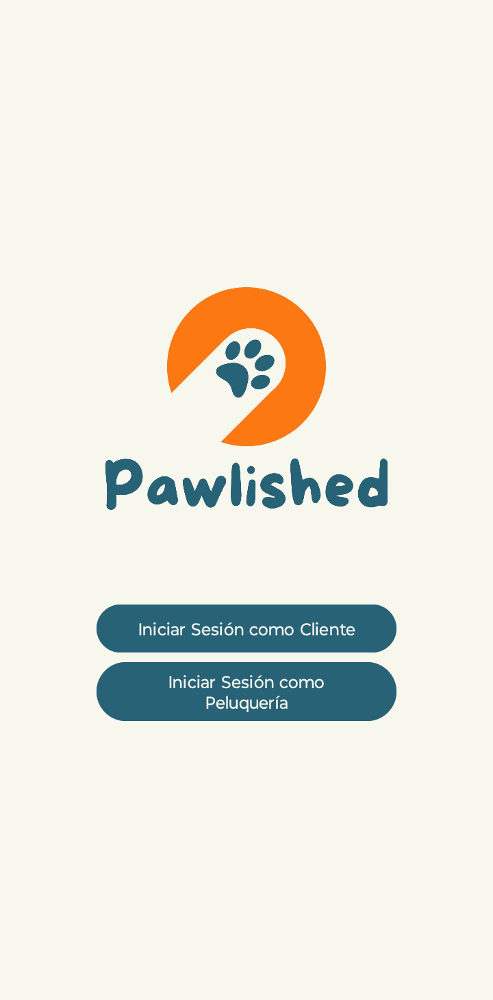
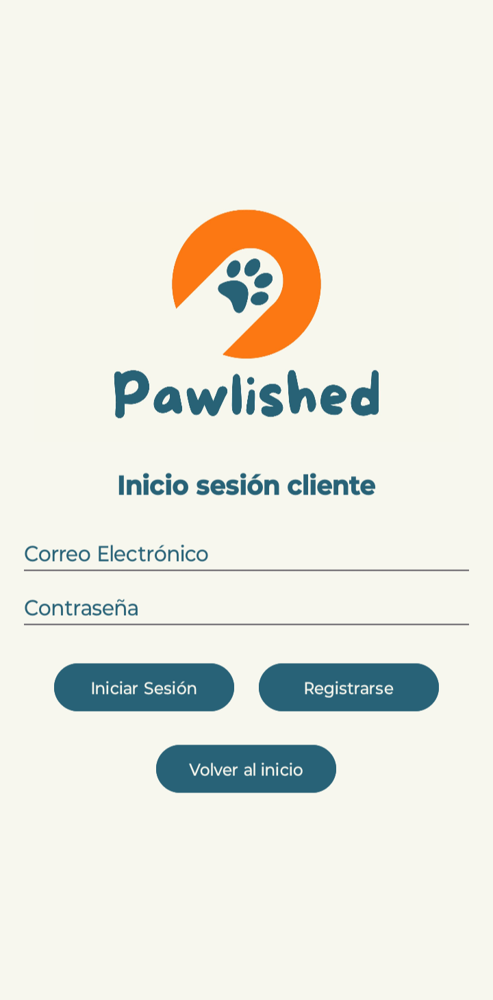
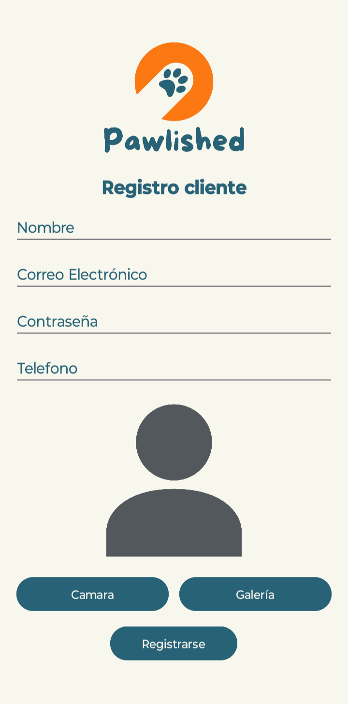
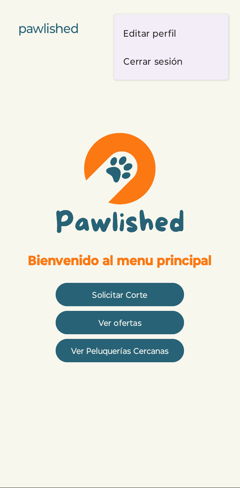
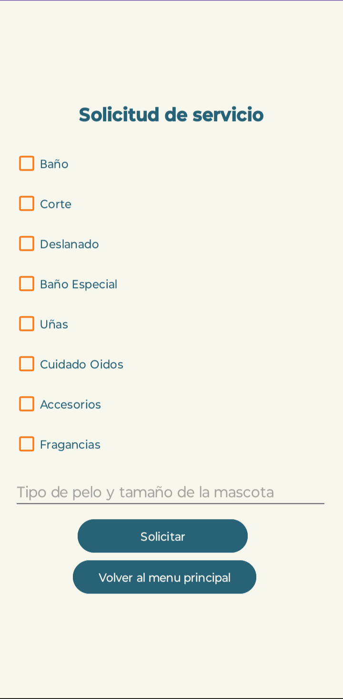
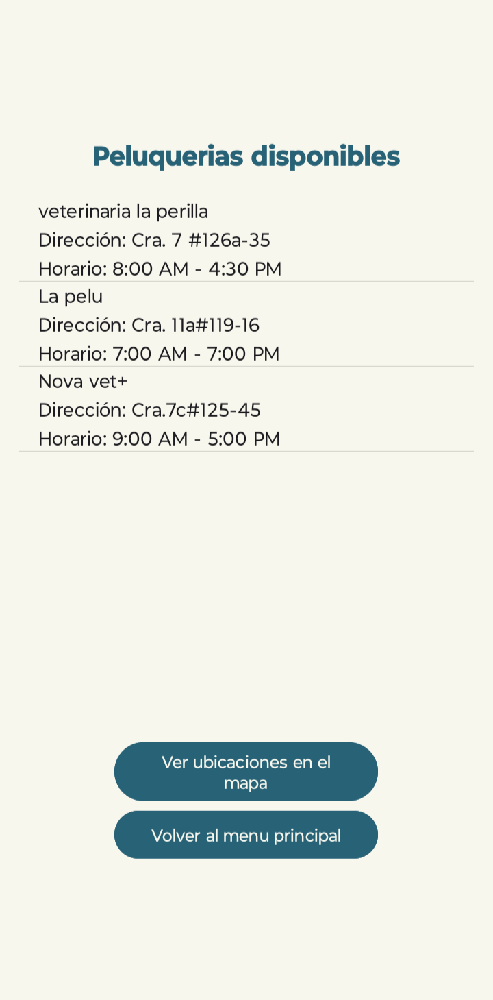
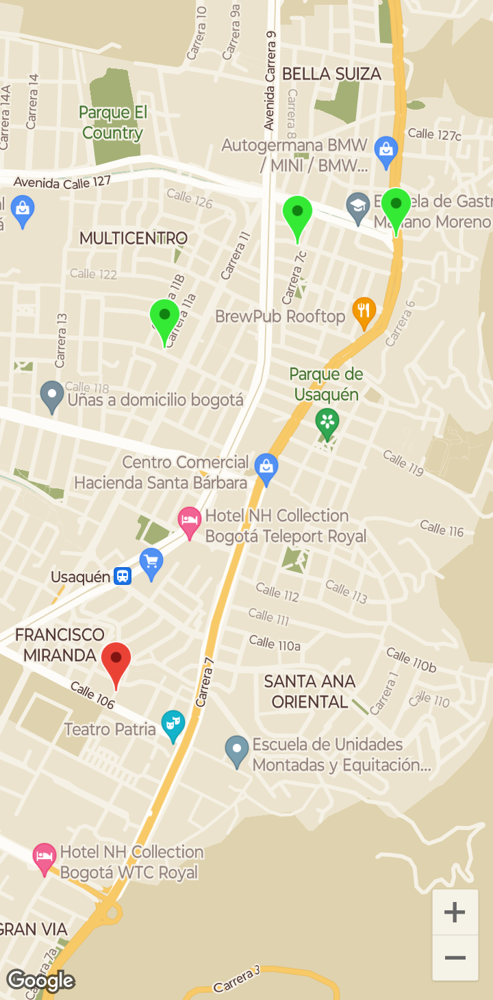
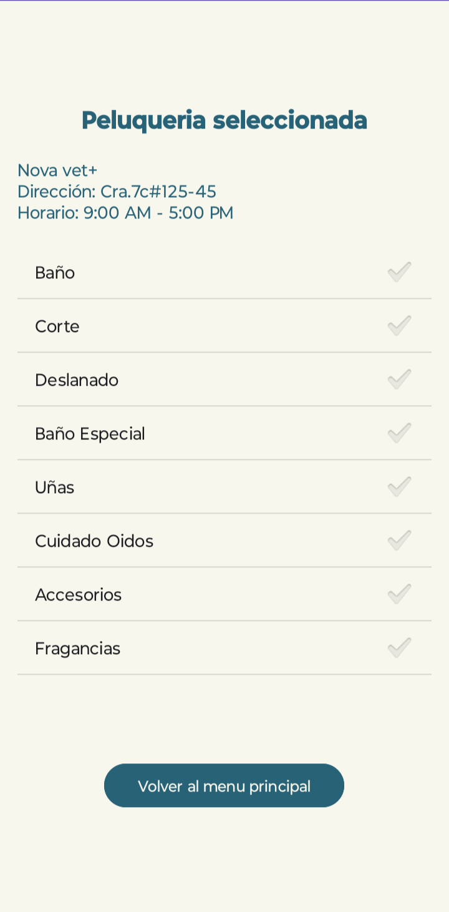
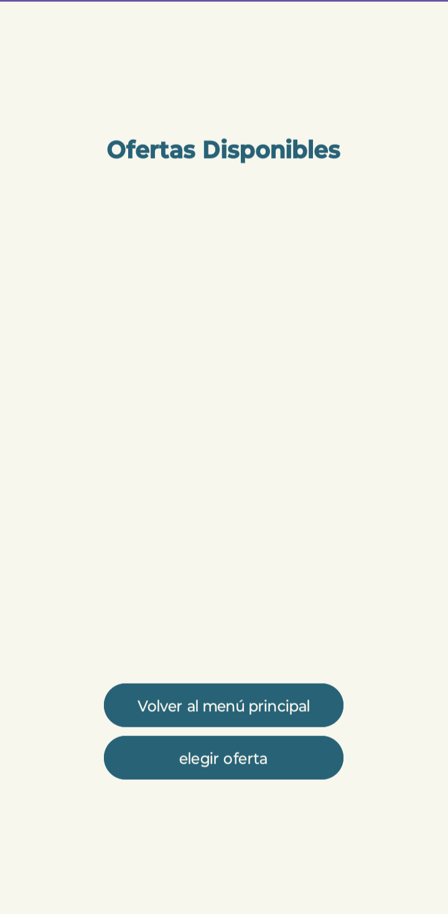
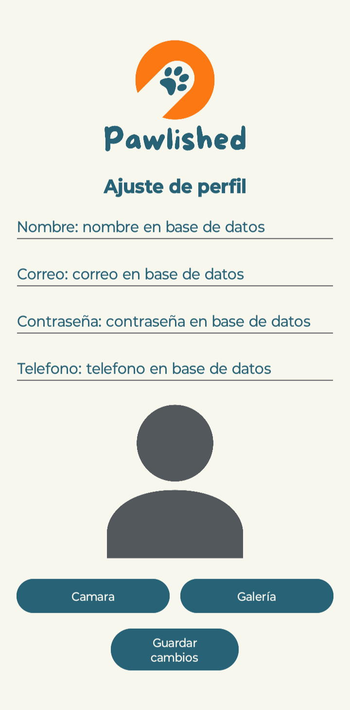

# Manual de usuario 📖

Bienvenido al manual de usuario de Pawlished 🐾 aca te explicaremos como funciona y el flujo de nuestra app.

Primero, al abrir la app nos encontraremos dos botones para elegir si somos un cliente o una peluqueria y dependiendo del botón que oprimas cambiara el flujo de la app para adaptarse al tipo de usuario que eres.

 Pantalla principal Pawlished 

## Cliente 🐕‍🦺

Una vez seleccionabos "iniciar sesión como cliente" veremos un nuevo menu donde podremos registranos o iniciar sesión.

### Inicio de sesión 🔑 

Para iniciar sesión como cliente debes tener una cuenta creada previamente, si no la tienes puedes registrarte en el botón que dice "Registrarse".

 Pantalla inicio de sesión cliente 

### Registro 📝

Al darle click en el boton de registro te llevara a esta nueva pantalla donde pondras tus datos para crear una cuenta, tambien podras asignar una foto de perfil desde tu galeria o tomar una en el momento de crear la cuenta.

 Pantalla inicio de sesión cliente 

### Menu principal 🏠

Una vez iniciada la sesión como cliente veremos el menu principal donde podremos ver las opciones que tenemos como cliente. En esta pantalla tenemos 3 botones y un menu desplegable para editar nuestro perfil o cerrar sesión.

 Menu principal cliente y menu desplegable 

### Solicitar corte 🐩

Al darle click al boton de "Solicitar corte" nos llevara a una nueva pantalla donde podremos ver los servicios disponibles y elegir el que queramos, tambien se deben poner algunos datos sobre la mascota.

 Solicitud de servicio 

Posteriormente se le debe dar al boton de "Solicitar" para que se envie la solicitud a las peluquerias cercanas, donde podremos seleccionar la que mas nos guste. En esta pantalla tenemos un boton para ver las peluquerias en el mapa, donde tu ubicación es el marcador rojo y las peluquerias son los marcadores verdes, tambien dandole click sobre estos marcadores veremos la ruta hasta el lugar y nos brindara informacion como la distancia y el tiempo que tardamos en llegar.

 Lista de peluquerias cercanas y sus ubicaciones en el mapa 

Finalmente en esta pantalla veremos la peluqueria que seleccionamos y los detalles de nuestra solicitud.

 Peluqueria seleccionada y detalles de solicitud 

### Ver ofertas 📩

Al darle click en el boton "Ver ofertas" podremos ver las ofertas que nos han enviado las peluquerias con sus detalles y podremos aceptar la que mas nos guste.

 Ofertas de peluquerias 

### Ver peluquerias cercanas 📍

Al darle click al boton "Ver peluquerias cercanas" podremos ver las peluquerias cercanas a nuestra ubicación en una lista y tambien se podran ver en el mapa, donde tu ubicación es el marcador rojo y las peluquerias son los marcadores verdes, tambien dandole click sobre estos marcadores veremos la ruta hasta el lugar y nos brindara informacion como la distancia y el tiempo que tardamos en llegar.

 Lista de peluquerias cercanas y sus ubicaciones en el mapa 

### Editar perfil 👤

Al darle click al boton "Editar perfil" podremos editar nuestros datos y cambiar nuestra foto de perfil.

 Pantalla editar perfil 

## Peluqueria 💈

### Inicio de sesión 🔑

### Registro 📝

### Menu principal 🏠

### Ver solicitudes 📩

### Ver solicitudes aceptadas ✅

### Editar perfil 👤