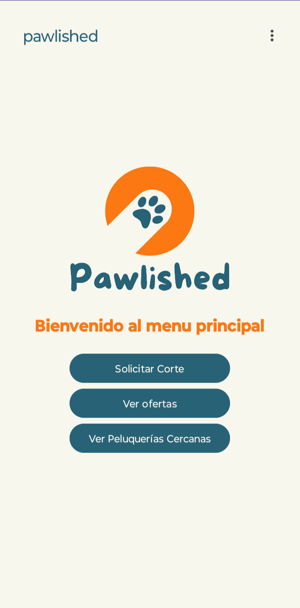
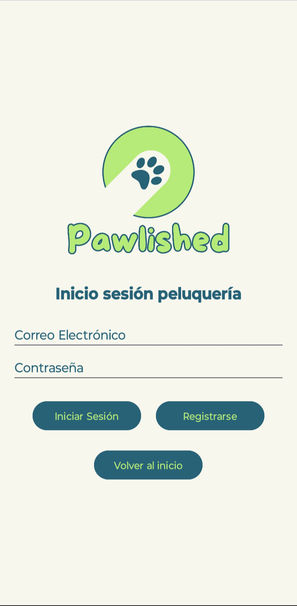
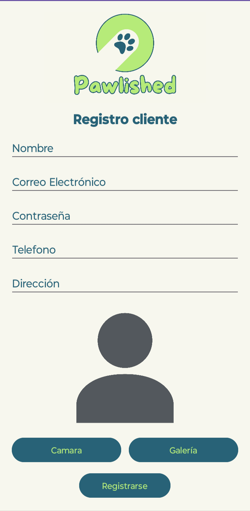
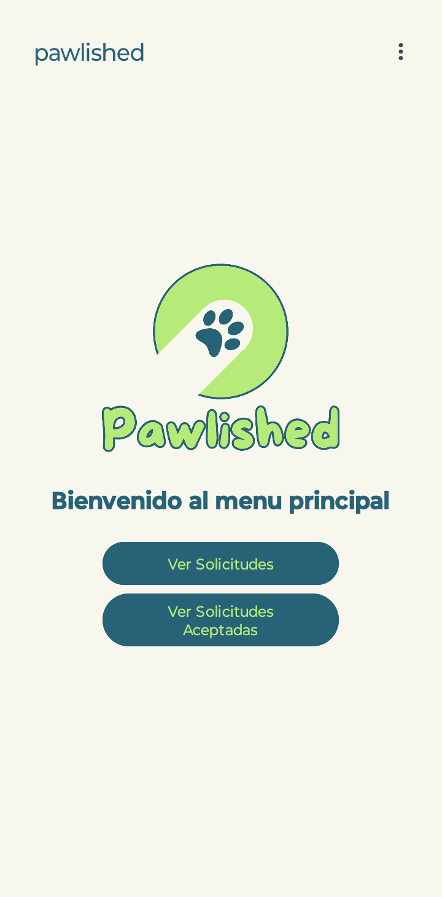
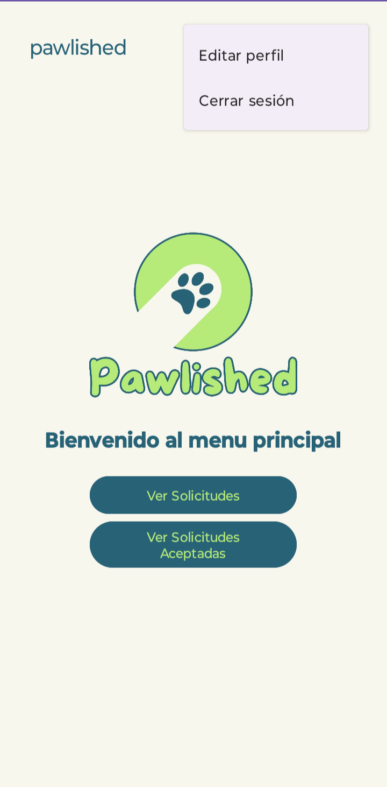
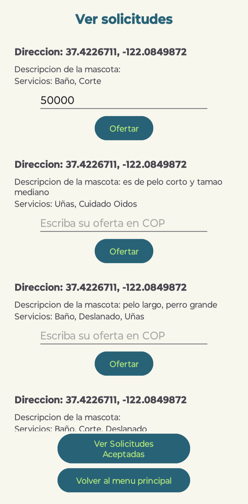
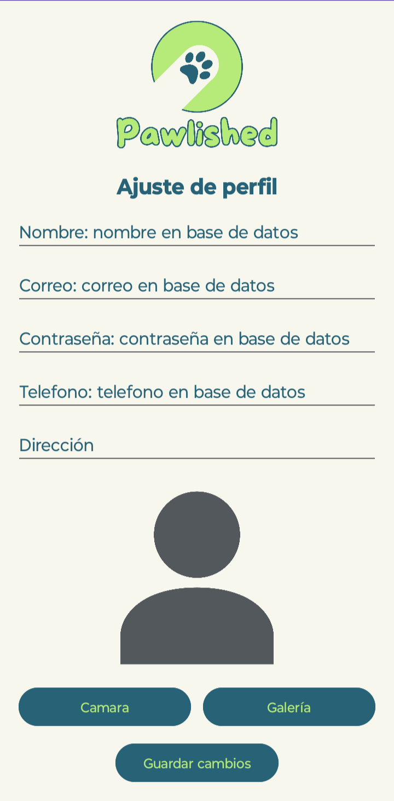

# Manual de usuario 📖

Bienvenido al manual de usuario de Pawlished 🐾 aca te explicaremos como funciona y el flujo de nuestra app.

Primero, al abrir la app nos encontraremos dos botones para elegir si somos un cliente o una peluquería y dependiendo del botón que oprimas cambiara el flujo de la app para adaptarse al tipo de usuario que eres.

 Pantalla principal Pawlished 

## Cliente 🐕‍🦺

Una vez seleccionabos "iniciar sesión como cliente" veremos un nuevo menu donde podremos registranos o iniciar sesión.

### Inicio de sesión 🔑 

Para iniciar sesión como cliente debes tener una cuenta creada previamente, si no la tienes puedes registrarte en el botón que dice "Registrarse".

 Pantalla inicio de sesión cliente 

### Registro 📝

Al darle click en el botón de registro te llevara a esta nueva pantalla donde pondras tus datos para crear una cuenta, tambien podras asignar una foto de perfil desde tu galeria o tomar una en el momento de crear la cuenta.

 Pantalla de registro cliente 

### Menu principal 🏠

Una vez iniciada la sesión como cliente veremos el menu principal donde podremos ver las opciones que tenemos como cliente. En esta pantalla tenemos 3 botones y un menu desplegable para editar nuestro perfil o cerrar sesión.

 

 Menu principal cliente y menu desplegable 

### Solicitar corte 🐩

Al darle click al botón de "Solicitar corte" nos llevara a una nueva pantalla donde podremos ver los servicios disponibles y elegir el que queramos, tambien se deben poner algunos datos sobre la mascota.

 Solicitud de servicio 

Posteriormente se le debe dar al botón de "Solicitar" para que se envie la solicitud a las peluquerías cercanas y volvemos al menu principal.

### Ver ofertas 📩

Al darle click en el botón "Ver ofertas" podremos ver las ofertas que nos han enviado las peluquerías con sus detalles y podremos aceptar la que mas nos guste.

 Ofertas de peluquerías 

Finalmente en esta pantalla veremos la peluquería que seleccionamos y los detalles de nuestra solicitud.

 Peluquería seleccionada y detalles de solicitud 

### Ver peluquerías cercanas 📍

Al darle click al botón "Ver peluquerías cercanas" podremos ver las peluquerías cercanas a nuestra ubicación en una lista y tambien se podran ver en el mapa, donde tu ubicación es el marcador rojo y las peluquerías son los marcadores verdes, tambien dandole click sobre estos marcadores veremos la ruta hasta el lugar y nos brindara informacion como la distancia y el tiempo que tardamos en llegar.

 

 Lista de peluquerías cercanas y sus ubicaciones en el mapa 

### Editar perfil 👤

Al darle click al botón "Editar perfil" podremos editar nuestros datos y cambiar nuestra foto de perfil.

 Pantalla editar perfil 

## Peluquería 💈

Una vez seleccionabos "iniciar sesión como peluquería" veremos un nuevo menu donde podremos registranos o iniciar sesión.

### Inicio de sesión 🔑

Para iniciar sesión como cliente debes tener una cuenta creada previamente, si no la tienes puedes registrarte en el botón que dice "Registrarse".

 Pantalla inicio de sesión peluquería 

### Registro 📝

Al darle click en el botón de registro te llevara a esta nueva pantalla donde pondras tus datos para crear una cuenta, tambien podras asignar una foto de perfil desde tu galeria o tomar una en el momento de crear la cuenta.

 Pantalla de registro peluquería 

### Menu principal 🏠

Una vez iniciada la sesión como peluquería veremos el menu principal donde podremos ver las opciones que tenemos como peluquería. En esta pantalla tenemos 2 botones y un menu desplegable para editar nuestro perfil o cerrar sesión.

 

 Menu principal peluqería y menu desplegable 

### Ver solicitudes 📩

Al darle click al botón "Ver solicitudes" podremos ver las solicitudes que nos han enviado los clientes con sus detalles y podremos hacer ofertas que los clientes pueden aceptar o no.

 Pantalla ver solicitudes 

### Ver solicitudes aceptadas ✅

Al darle click al botón "Ver solicitudes aceptadas" podremos ver las solicitudes que le enviamos a los clientes y que ya han sido aceptadas por ellos,.

 Pantalla ver solicitudes aceptadas

### Editar perfil 👤

Al darle click al botón "Editar perfil" podremos editar nuestros datos y cambiar nuestra foto de perfil.

 Pantalla editar perfil 